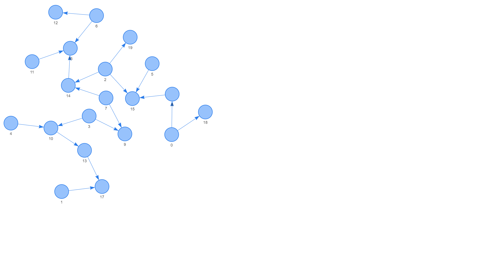
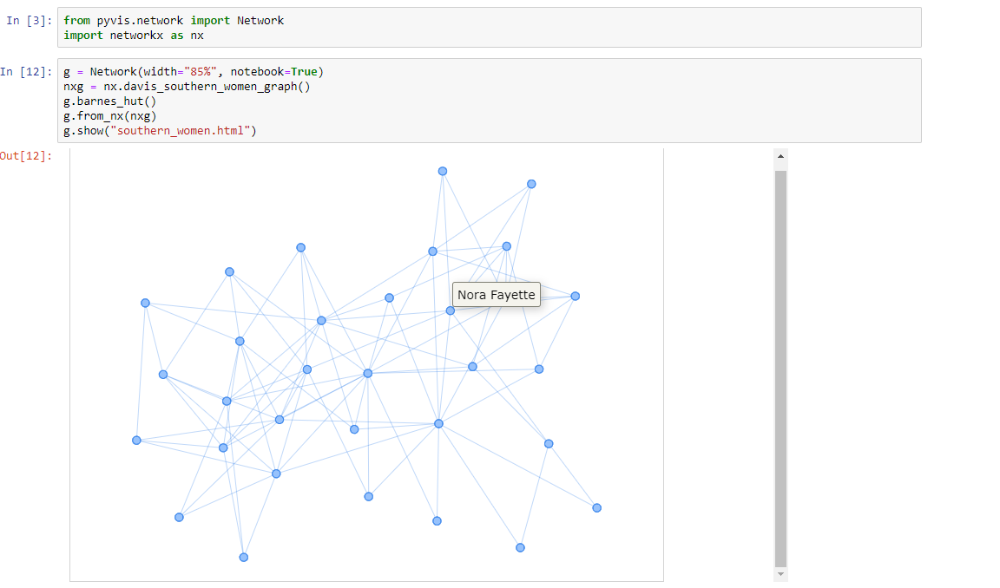

:author: Giancarlo Perrone
:email: gperrone@westhealth.org
:institution: West Health Institute
:bibliography: ourbib

-------------------------------------------
Network visualizations with Pyvis and VisJS
-------------------------------------------

.. class:: abstract

   Pyvis is a Python module that enables visualizing and interactively manipulating network graphs in the Jupyter notebook, or as a standalone web application. Pyvis is built on top of the powerful and mature VisJS JavaScript library, which allows for fast and responsive interactions while also abstracting away the low-level JavaScript and HTML. This means that elements of the rendered graph visualization, such as node/edge attributes can be specified within Python and shipped to the JavaScript layer for VisJS to render. This declarative approach makes it easy to quickly draft up graph visualizations to begin exploring relationships in data. In addition, Pyvis offers a wide variety of customizability like the ability to assign visual node and edge properties such as colors, sizes, and hover tooltips. The front-end physics engine is also configurable from a Python interface, allowing for the fine-tuning of a Graph layout. In this paper, we outline the various use cases of Pyvis with examples to demonstrate features applicable to any analysis workflow. A brief overview of Pyvis' implementation will also be presented to present how a front-end binding is accomplished through simple Pyvis calls. 

.. class:: keywords

   networks, graphs, relationship

Introduction
------------

Successful Data Science pivots upon discovering meaningful relationships in data using intuitive visualizations. Visually representing these links helps to better understand the data and make data driven decisions. They are also intuitive and induce insight, offering a simple node-link structure, which can quickly expose patterns at a glance. Many research areas take advantage of the insight that network analysis techniques can offer. Fields in social networking, cognitive studies, telecommunications, and biological systems all leverage the applications of network theory and computation. Representing these relationships using a network graph is a common approach, but generating an interactive and fluid graph visualization can be a challenge, especially with large datasets. We introduce Pyvis, based upon the mature VisJS :cite:`visjs` JavaScript library which enables fluid and interactive visualizations of complex network graphs. Pyvis seeks to simplify the interactive process by implementing an existing JavaScript graphics library to abstract away the low-level front end components, keeping the construction of these network data structures limited to a Python scope.

The structure of a Pyvis network data structure aligns with the patterns expected by a VisJS object. This makes it easy to interpret and implement the underlying data structures from the Python layer, since the actual front end component is generated by the JavaScript library. A resulting static HTML document demonstrates the visual representation of a defined network, enveloping interactive components such as dragging, zooming, hovering, and clicking in order to offer the most amount of context possible. Extremely dense and complex networks benefit from this approach since existing network visualization tools are often static in nature, limiting the amount of visual context offered during data exploration. 

Prior to being made open source, Pyvis has been used extensively in internal data discovery projects to quickly explore and recognize patterns. We began development to serve as the front end component for an internal Data Reduction Network project. While we maintained an efficient data structure to represent the trends of hundreds of survey responses, our need for the visual capture of additional metadata lacked a solution. Initial approaches lacked an interactive factor, limiting our analysis in scope. Pyvis made it easy to abstract our existing data structure to just nodes and edges with our desired attributes. The visualization was then handed off to the VisJS layer to interpret the resulting data structure to give us a nice and fluid visual where we could really see the level of detail in each node and edge in our network. In this paper, we describe Pyvis under the hood and demonstrate key examples of how to create the data structures which result in the desired visualizations.

[In the next section, we discuss... Then we talk about layout...

Pyvis Usage
-----------
Getting started with Pyvis is as simple as having an installation of the Python language and the Pyvis package. It is recommended to visit the project documentation website :cite:`pyvis` in order to see the full requirements and installation procedure. All of the following examples will utilize standard data structures that should be familiar to anyone with some amount of Python knowledge. Pyvis’ interaction with the popular NetworkX package :cite:`networkx` will be demonstrated as well, although its current state is somewhat limited. The basic Network class is used to hold information about the internal graph and front end properties. All networks must be instantiated as a Network class instance:

.. code-block:: python

   from pyvis.network import Network
   g = Network()

Nodes can be added by providing an id and an optional label for visual aid. Note that node ids must be numerical or a string.

.. code-block:: python
   
   g.add_node(1)
   g.add_node(2)
   print(g)

.. code-block:: json

   {
    "Nodes": [
        1,
        2
    ],
    "Edges": [],
    "Height": "500px", 
    "Width": "500px"
   }

A list of nodes could be supplied to the `add_nodes` method:

.. code-block:: python
   
   nodes = ["a", "b", "c", "d"]
   g.add_nodes(nodes) 
   g.add_nodes("hello")

Keyword arguments can be used to add properties to the nodes in Network:

.. code-block:: python

   g = Network()
   g.add_nodes(
      [1,2,3],
      value=[10, 100, 400], # values adjust node size
      x=[21.4, 154.2, 11.2],
      y=[100.2, 23.54, 32.1],
      label=["NODE 1", "NODE 2", "NODE 3"],
      color=["#00ff1e", "#162347", "#dd4b39"]
   )
   g.show("example.html")

| There are various node properties that can be set while constructing a network. These properties are meant to help the resulting visualization provide as much context as possible in regards to node metadata. These properties are defined as:

* size - The raw circumference of a single node
* value - Circumference of node but scaled according to all values
* title - The title displays over each node while mousing over it
* x - X coordinate of node for custom layouts
* y - Y coordinate of node for custom layouts
* label - A label appearing under each node
* color - The color of the node

| Nodes must exist in the network instance in order to add edges

.. code-block:: python

   g.add_edge(1, 2)
   # will adjust edge thickness
   g.add_edge(2, 3, weight=5)

Edges can be added all at once by supplying a list of tuples to a call to `add_edges()`. The following is an equivalent result:

.. code-block:: python

   g.add_edges([(1, 2), (2, 3, 5)])
   g.show("example.html")

| Notice how an optional element is included in the 3-tuple above (2, 3, 5) representing the weight of the edge. This additional edge data allows for expressing weighted networks and is clearly noticeable in the visualization.

Layout
------
| In situations where your network involves complex connections, Pyvis allows you to manually explore these relationships with intuitive mouse interactions. Nodes can be dragged into more visible positions if the layout is obstructing the view. 
| All of this is made possible by the front end engine provided by VisJS. Their extensive documentation defines several options for supplying layout and physics configurations to instances of a network. These physics options are built-in to VisJS, so tweaking the physics of the rendered simulation is as simple as providing the parameters to the specific solver. 

The physics options dictates how a user can interact with the objects in the graph. The intent of the physic options is to make manipulating graph objects feel more intuitive when moving nodes around. As an example, the user can manipulate a portion of a graph that is densely populated to view a graph segment of the interest more clearly. VisJS lends an intutive feel by implement one of several physical simulations such as Barnes Hut :cite:`barneshut`. Others are mentioned in the VisJS documentation :cite:`visjs-physics`.

| We have the liberty of configuring the physics engine from within Pyvis:

.. code-block:: python

   g = Network()
   # physics solvers supported: 
   # barnesHut, forceAtlas2Based, repulsion,
   # hierarchicalRepulsion
   g.barnes_hut(
    gravity=-80000,
    central_gravity=0.3,
    spring_length=250,
    spring_strength=0.001,
    damping=0.09,
    overlap=0,
   )
   print(g.options.physics)
   {'enabled': True,
   'stabilization':
   <pyvis.physics.Physics.Stabilization
   object at 0x7f99e6a03f90>,
   'barnesHut': <pyvis.physics.Physics.barnesHut
   object at 0x7f99e6de3710>}

| In order to avoid the scenario of "guessing" parameter values for an optimal network physics configuration, VisJS offers a useful interaction for experimenting with theses values. 
| These interactions are enabled via Pyvis:

.. code-block:: python

   # choose to only show the physics options
   g.show_buttons(filter_=["physics"])

| Here, we choose to display the options for the physics component of the network. Omitting a filter in the call will display the configuration of the entire network including nodes, edges, layout, and interaction. The JSON options displayed in the visualization represent the current configuration depending on the displayed sliders. You can copy/paste those options to supply your network with custom settings:

.. code-block:: python

   g.set_options(
      """
      var options = {
         "physics": {
            "repulsion": {
               "centralGravity": 1.3,
               "springConstant": 0.08,
               "nodeDistance": 90,
               "damping": 0.19
            },
            "maxVelocity": 45,
            "minVelocity": 0.19,
            "solver": "repulsion",
            "timestep": 0.34
         }
      }
      """
   )
   print(g.options)

.. code-block:: python

   {'physics': {'repulsion': {'centralGravity': 1.3,
   'springConstant': 0.08,
   'nodeDistance': 90,
   'damping': 0.19},
   'maxVelocity': 45,
   'minVelocity': 0.19,
   'solver': 'repulsion',
   'timestep': 0.34}}

| The methods of a Network instance aim to construct an internal structure compatible with VisJS, demonstrated by the consistent pattern of JSON outputs seen above.

NetworkX Support
----------------
Although Pyvis supports its own methods for constructing a network data structure, you might feel more comfortable using the more established and dedicated NetworkX package. Pyvis takes this into account by offering a way to define your data as a NetworkX graph instance to then supply to a call to Pyvis.

.. code-block:: python

   import networkx as nx
   from pyvis.network import Network
   
   nxg = nx.random_tree(20)
   g=Network(directed=True)
   g.from_nx(nxg)
   g.show("networkx.html")

| Pyvis current behavior recognizes the basic topology of a NetworkX graph, not accounting for any custom attributes provided. Any other attributes like node color, size, and layout would need to be manually added to the resulting Pyvis graph.
| Future plans are to fully integrate NetworkX graphs to fully interpret them, preserving attributes in the resulting Pyvis visualizations.

Jupyter Support
---------------
For efficient prototyping of visualized graphs, Pyvis aims to utilize Jupyter's front-end IFrame features to embed the graph in a notebook output cell.
With that in mind, embedding a Pyvis visualization into a Jupyter notebook is essentially the same as described above. The only difference is that one should pass in a notebook argument during instantiation. The result of the visualization is shown in the output cell below the ``show()`` invocation. Pyvis upon the call to ``show()`` writes the HTML that serves an IFrame, which displays the result in the output cell.
|

| One thing to keep in mind is that an HTML file is always generated due to the dependence on the VisJS JavaScript bindings.

Example
-------

| To get a better understanding of the flow of a typical Pyvis network visualization, we can take a look at the following code snippet to show off a typical application of the features. I have taken a Game of Thrones dataset (:cite:`gthrones` Storm of Swords Dataset) defining the relationships between characters and the frequencies between them to create a network to naturally express this. Specifically, it is a csv file containing pairs of characters and a weight between them.

.. code-block:: python

   from pyvis.network import Network
   import pandas as pd

   got_net = Network(
      height="750px",
      width="100%",
      bgcolor="#222222",
      font_color="white"
   )

   # set the physics layout of the network
   got_net.barnes_hut()
   got_data = pd.read_csv("stormofswords.csv")

   sources = got_data['Source']
   targets = got_data['Target']
   weights = got_data['Weight']

   edge_data = zip(sources, targets, weights)

   for e in edge_data:
      src = e[0]
      dst = e[1]
      w = e[2]

      got_net.add_node(src, src, title=src)
      got_net.add_node(dst, dst, title=dst)
      got_net.add_edge(src, dst, value=w)

   neighbor_map = got_net.get_adj_list()

   # add neighbor data to node hover data
   for node in got_net.nodes:
      node["title"] += " Neighbors: " + \
              " ".join(neighbor_map[node["id"]])
      node["value"] = len(neighbor_map[node["id"]])

   got_net.show("gameofthrones.html")

| At a glance, the resulting relationship network looks too intertwined to make any practical conclusions. However, the beauty of Pyvis is that each and every component of the network can be focused. Zooming in to a dense portion of the network we can hover over a particular node to get a glimpse of the scenario:

| This hover tooltip offers the context behind a particular node. We can see the immediate neighbors for each and every node since we provided a `title` attribute during the network construction. This simple example can be expanded upon to create more custom interactions tailored to specific needs of a dataset.
| The network also makes use of weights. By providing a `value` attribute to each node we can see these values being represented by a node's size. In the code I used the amount of neighbors to dictate the node weight. This is a strong visual cue which makes it easy to see which nodes have the most connections.
| The edge weights are assigned in a similar manner, although the dataset already provided the connection strength between nodes. These edge weights are differentiable in the final visualization, once again proving the usefulness of Pyvis' front-end features.

Under the Hood
--------------
VisJS simplifies their definition of a network to a declarative set of objects. Nodes, Edges, and an Options JSON object are given to the VisJS Network constructor. The following basic example from their documentation proves this:

.. code-block:: JavaScript

   // create an array with nodes
   var nodes = new vis.DataSet([
      {id: 1, label: 'Node 1'},
      {id: 2, label: 'Node 2'},
   ]);

   // create an array with edges
   var edges = new vis.DataSet([
      {from: 1, to: 2},
   ]);

   // create a network
   var container = document.getElementById('mynetwork');

   // provide the data in the vis format
   var data = {
      nodes: nodes,
      edges: edges
   };
   var options = {};

   // initialize your network!
   var network = new vis.Network(container, data, options);

| This pattern makes Jinja :cite:`jinja` templating an obvious candidate for generalizing a set of JavaScript declarations. VisJS documentation provides a complete set of supported attributes for each data structure, so incorporating them into the Python layer involves representing each object as Python objects which are then serialized and sent to Jinja to handle the templating.
| A simple example of this process in action is outlined below:

.. code-block:: python

   self.html = template.render(nodes=nodes, edges=edges)

| In this case, a template HTML file is rendered with node and edge data matching a format compatible with a VisJS Network instance.  

Conclusion
----------

Pyvis is a powerful python module for visualizing and interactively manipulating network graphs in a standalone web application or a Jupyter notebook. Pyvis brings the power of VisJS into the python world. Pyvis makes accessible to the python programmer or data scientist on Jupyter the network visualization capabilities of VisJS. 

With the methods described here using Pyvis, a user can easily develop highly interactive network visualizations.

Code samples presented here, and with the corresponding poster presentation, as well as other supplemental material are available at West Health's github repository at
`https://github.com/Westhealth/scipy2020/pyvis
<https://github.com/Westhealth/scipy2020/pyvis/>`_.
